# Vision-Based UGV Navigation (GPS-Denied)

ROS 2 **Jazzy** stack for outdoor camera-first autonomy: **semantic segmentation → fused odometry → RTAB-Map SLAM → Nav2**.

Built for enclosed / GPS-weak courtyards in Gazebo first, with the same architecture transferable to a real UGV.

<p align="center">
  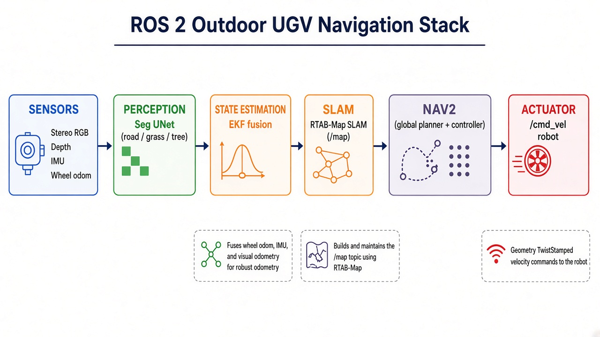
</p>

**One-line story:** cameras see → UNet understands road/hazards → EKF + RTAB localize on a map → Nav2 plans A→B → `/cmd_vel`.

---

## What this repo does

| Stage | Role |
|-------|------|
| **Sense** | Stereo RGB, depth, IMU, wheel odom (Gazebo) |
| **Understand** | UNet labels each pixel: background / road / grass / tree |
| **Localize & map** | RTAB-Map RGB-D SLAM → `/map` + `map→odom` |
| **Plan & act** | Nav2 global + local costmaps (geometry + semantic costs) → `/cmd_vel` |

Packages: `ugv_sim` · `ugv_data_collect` · `ugv_perception` · `ugv_slam` · `ugv_nav`

---

## Results & statistics

### Perception (UNet on courtyard dataset)

| Metric | Value |
|--------|------:|
| Training images (labelled) | **350** |
| Classes | 4 — `background`, `road`, `grass`, `tree` |
| Input size | 320 × 240 |
| Fine-tune (from prior weights) | epoch **4** (best checkpoint) |
| **Validation mIoU** | **≈ 0.901** |
| Per-class IoU (best ckpt) | bg **0.97** · road **0.84** · grass **0.99** · tree **0.80** |
| Val pixel accuracy | **≈ 0.95** |
| Auto-label pixel mix (approx.) | bg 34% · road 22% · grass 24% · tree 20% |

Weights: `data/models/unet_outdoor_best.pt`  
Raw capture: `data/images_courtyard_20260916_213150/`  
Labels: `data/dataset_autolabel/`

### Mapping (RTAB-Map)

| Metric | Value |
|--------|------:|
| Primary saved map DB | `data/maps/rtabmap_latest_saved.db` (~**90 MB**) |
| Graph size | **218** nodes · **419** links |
| Exported cloud (for viz) | ~**1.5M** voxel-filtered points |

Active/runtime DB used by launches: `data/maps/rtabmap.db`

---

## Architecture diagrams

### Full stack (this project)


### U-Net semantic segmentation (encoder–decoder + skips)

Classic U-Net-style backbone used for pixel-wise road / grass / tree / background labelling (see [Ronneberger et al., MICCAI 2015](https://arxiv.org/abs/1505.04597)).

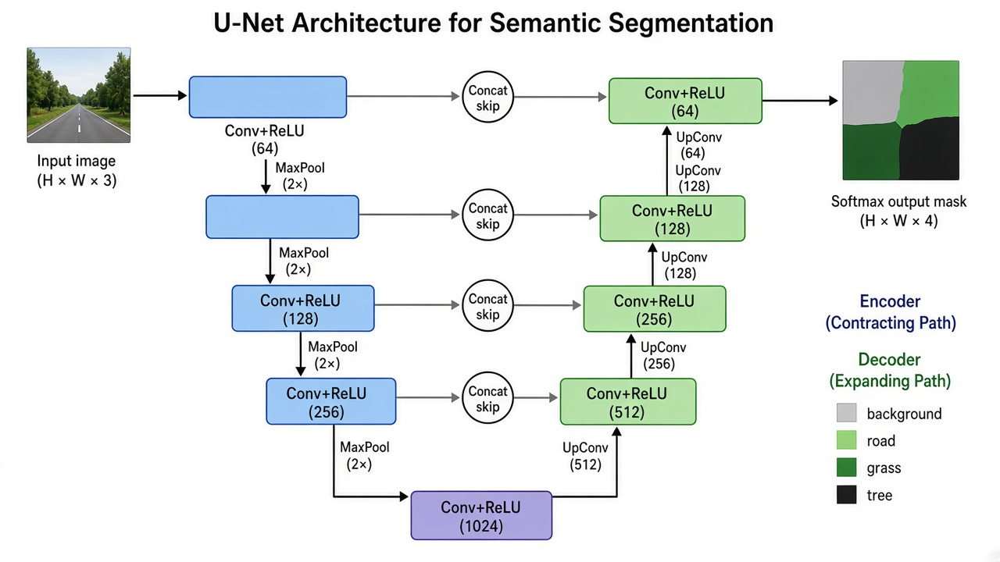

### ROS 2 Nav2 (planner · controller · costmaps · BT navigator)

Nav2 orchestrates global planning, local control, recoveries, and costmaps via a behavior-tree navigator ([Nav2 docs](https://docs.nav2.org/concepts/)).

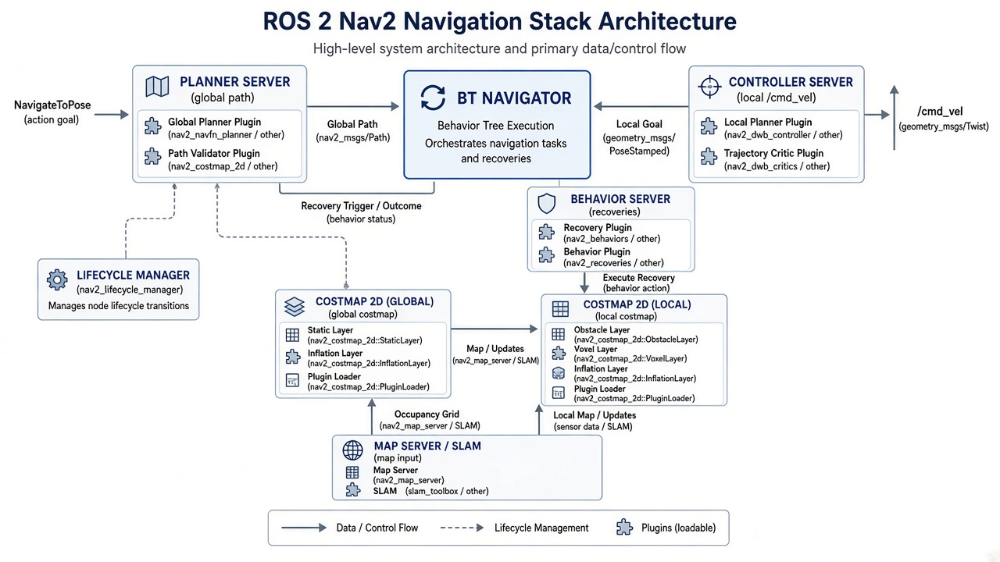

---

## Perception visuals (mask & segmentation)

RGB camera · class mask · colourised labels (road / grass / tree / background):

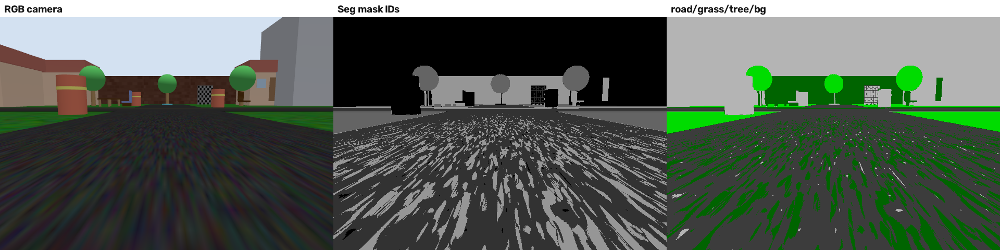

Auto-label overlay examples from the courtyard dataset:

<p align="center">
  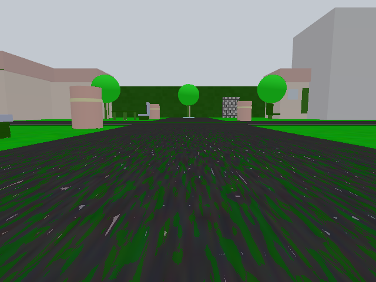
  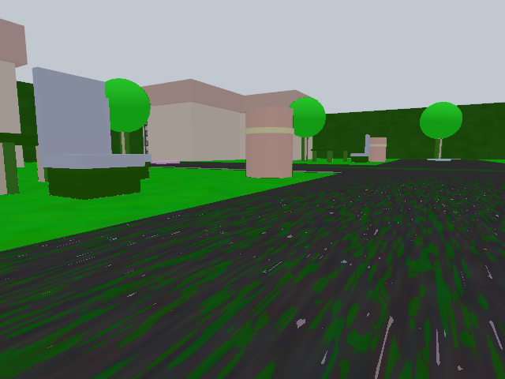
</p>

Model check — validation panel (**RGB | ground-truth | prediction**):

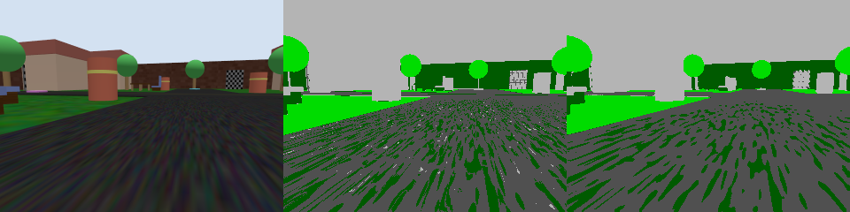

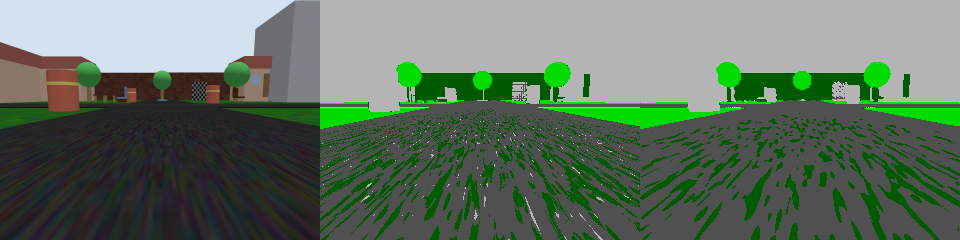

---

## Mapping & navigation scene

Robot view in the enclosed courtyard (navigation environment):

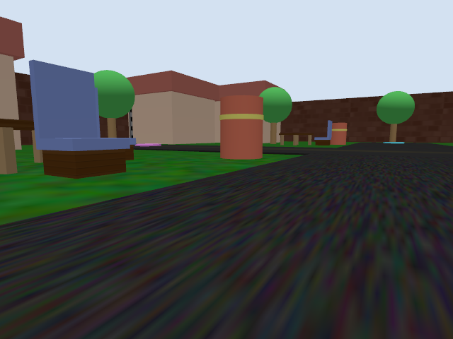

RTAB-Map trajectory from the saved courtyard map (**218 nodes**):

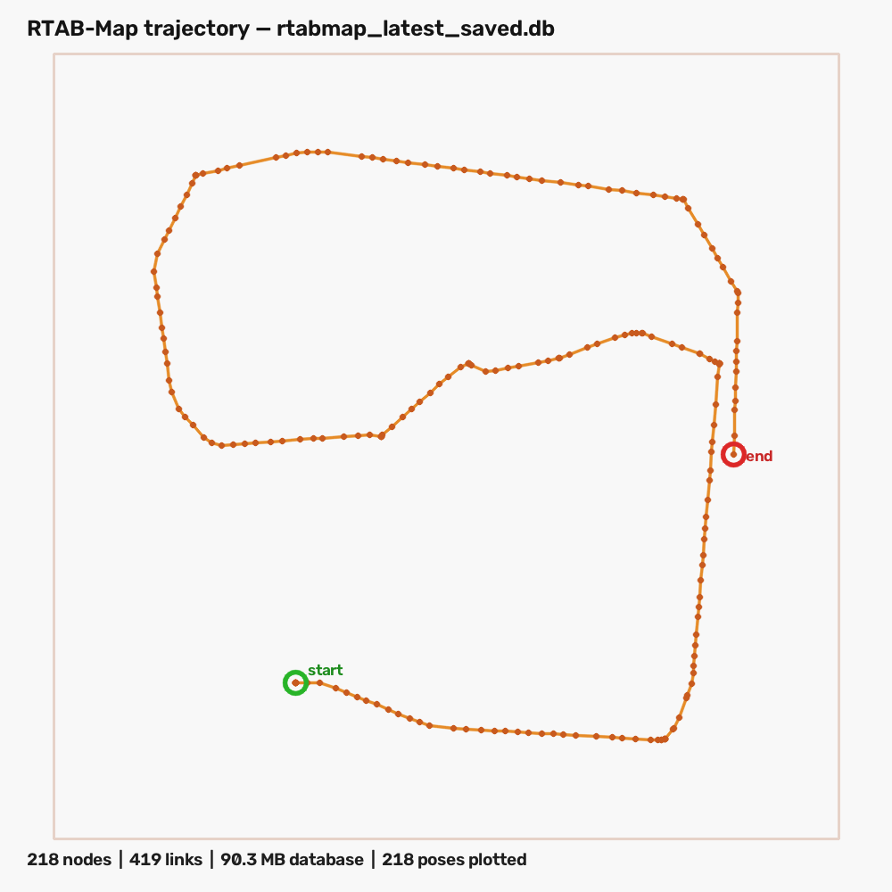

Top-down view of the reconstructed RGB-D point cloud:

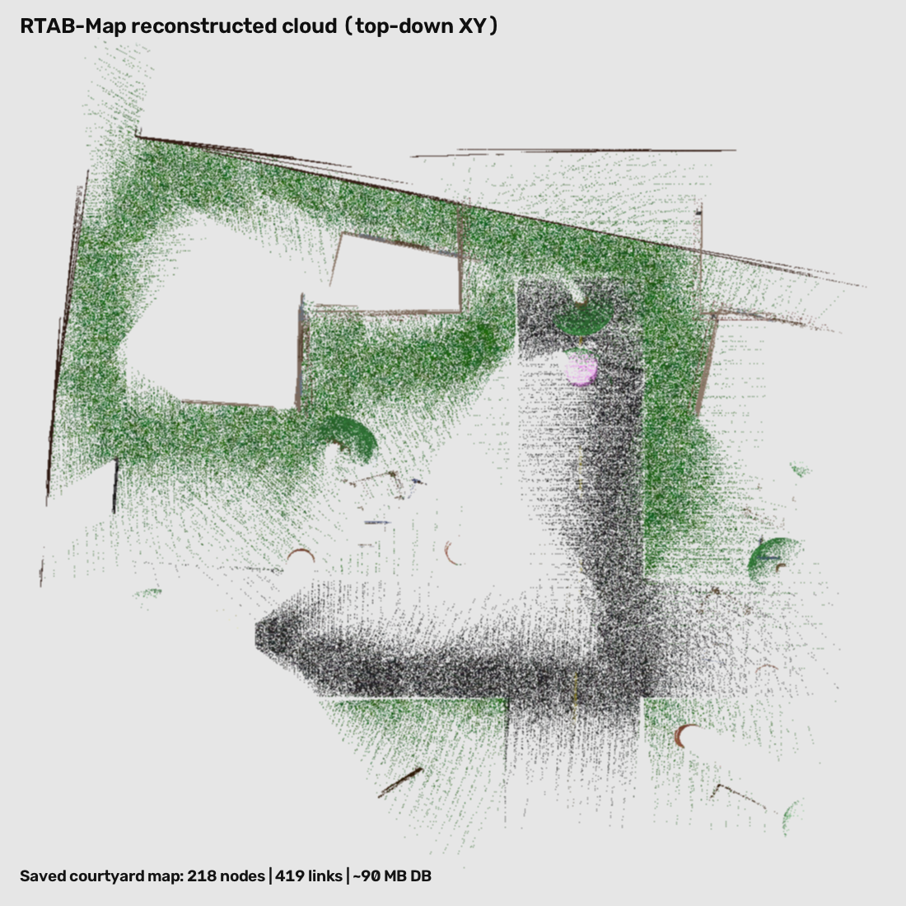

---

## Setup

```bash
cd ~/ugv_vision_nav_ws
source /opt/ros/jazzy/setup.bash
colcon build --symlink-install
source scripts/setup_env.sh   # ROS + RTAB .opt overlay + torch site-packages
```

---

## 1) Mapping pass (build RTAB DB)

```bash
# Terminal A
source ~/ugv_vision_nav_ws/scripts/setup_env.sh
ros2 launch ugv_sim sim.launch.py

# Terminal B
source ~/ugv_vision_nav_ws/scripts/setup_env.sh
ros2 launch ugv_nav full_stack.launch.py mapping:=true use_nav2:=false use_vo:=true

# Terminal C
ros2 run teleop_twist_keyboard teleop_twist_keyboard
```

DB: `~/ugv_vision_nav_ws/data/maps/rtabmap.db`  
**Warning:** `mapping:=true` can wipe/rebuild the DB — use `mapping:=false` to keep a saved map.

---

## 2) Localize + Nav2 A→B

```bash
source ~/ugv_vision_nav_ws/scripts/setup_env.sh
ros2 launch ugv_sim sim.launch.py
ros2 launch ugv_nav full_stack.launch.py mapping:=false use_nav2:=true use_vo:=true
```

In RViz: Fixed Frame `map` → **Nav2 Goal** to send point B.

---

## Key topics

| Topic | Meaning |
|-------|---------|
| `/camera/image_raw` | RGB (UNet + RTAB) |
| `/camera/depth/image_raw` | Depth |
| `/imu`, `/wheel/odom` | IMU / wheel |
| `/odometry/filtered` | EKF fused odom → RTAB / Nav2 |
| `/perception/segmentation` | Class mask |
| `/perception/segmentation_overlay` | Colour overlay |
| `/perception/semantic_obstacles` | Semantic costs / obstacles |
| `/map` | RTAB occupancy |
| `/cmd_vel` | Nav2 output |

---

## Retrain perception on a new world

```bash
# collect while driving
ros2 launch ugv_data_collect collect_images.launch.py output_dir:=~/ugv_vision_nav_ws/data/images_NEW

python3 scripts/auto_label_gazebo.py \
  --images_dir ~/ugv_vision_nav_ws/data/images_NEW \
  --out_dir ~/ugv_vision_nav_ws/data/dataset_autolabel --clean

python3 scripts/train_unet.py \
  --data_dir ~/ugv_vision_nav_ws/data/dataset_autolabel \
  --resume ~/ugv_vision_nav_ws/data/models/unet_outdoor_best.pt \
  --epochs 8 --batch_size 4 --num_workers 0
```

Copy best checkpoint to `data/models/unet_outdoor_best.pt`.

---

## Notes

- Depth in sim is a dedicated Gazebo depth camera aligned with the left RGB (not stereo disparity).
- Nav2 uses **2D** occupancy; the same RTAB DB can be opened in 3D (`rtabmap /path/to/rtabmap.db`) for teaching screenshots.
- VO (`use_vo`) is optional into the EKF — RTAB consumes **fused** `/odometry/filtered`, not raw VO.
- More teaching detail: `docs/ARCHITECTURE_OVERLAY.tex`, `docs/ARCHITECTURE_TEACHING_GUIDE.md`.

## License / attribution

- U-Net concept: Ronneberger, Fischer, Brox — *U-Net: Convolutional Networks for Biomedical Image Segmentation*, MICCAI 2015.
- Nav2 concepts: [docs.nav2.org](https://docs.nav2.org/).
- RTAB-Map: Labbé & Michaud — *Journal of Field Robotics*, 2019.
